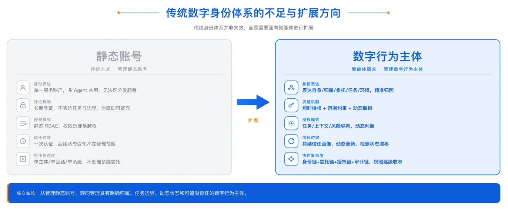
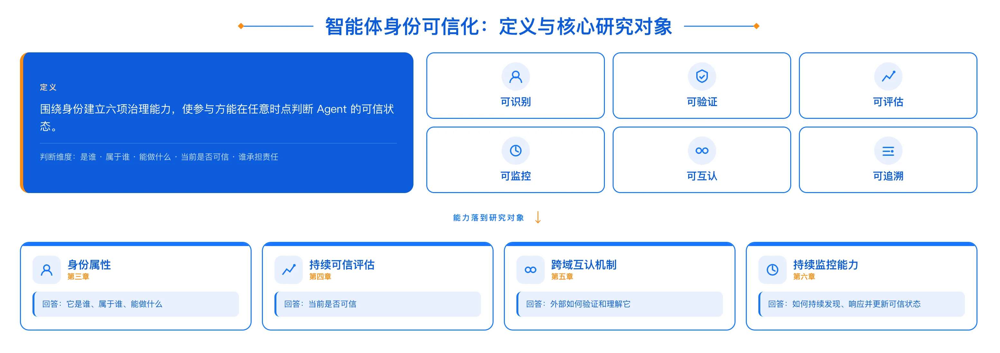
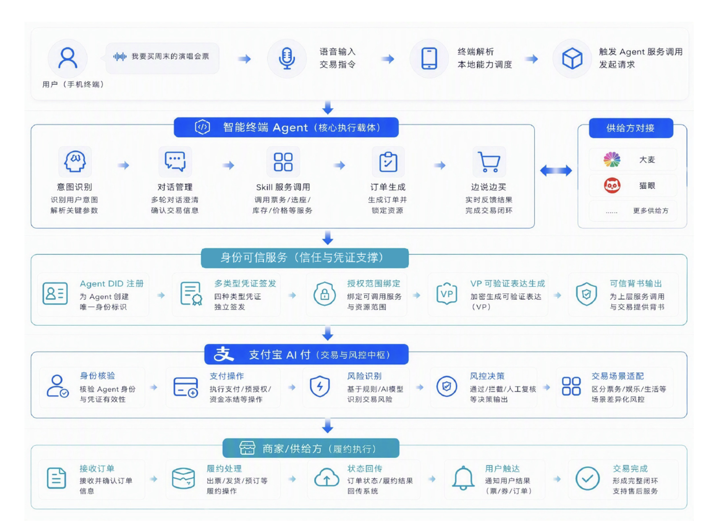

# 智能体身份可信化

## 为什么需要智能体身份可信化？

大模型驱动的智能体，正在改变数字世界的运行方式：从“软件执行指令”，走向“智能体理解目标并自主行动”。长期以来，企业数字化主要由预设代码、固定流程和权限配置驱动；如今，智能体已经能够理解任务目标、规划行动路径、调用工具和服务、根据反馈调整策略，并与其他智能体及外部系统协同工作。

智能体的能力边界，也正从辅助性场景延伸至企业经营的关键环节。它可以访问内部业务系统，参与研发运维和审批，代表用户搜索、下单与支付，并在多个系统和主体之间持续协作、分解任务和传递授权。当智能体开始接触敏感数据、影响业务结果，并产生真实的经济与责任后果，产业关注的重点也随之从“模型能做什么”，转向“谁在行动、代表谁行动、被授权做什么、如何约束行动，以及出了问题谁负责”。

传统以账号、登录和固定权限为中心的身份体系，也因此面临新的治理挑战。对于能够长期运行、动态决策和跨域调用的智能体，系统不仅需要在接入时确认其身份，更需要在每一次关键行动中持续判断其是否仍然可信。一次认证，并不意味着持续可信；一次授权，也不意味着智能体可以在任何场景、任何时间、以任何方式行动。

## 智能体身份问题正在被重新定义

智能体身份治理需要从“静态身份管理”走向“持续信任管理”：围绕智能体身份，建立可识别、可验证、可评估、可监控、可互认、可追溯的治理能力，使参与方能够在任意时点判断：这个智能体是谁，属于谁，被授权做什么，当前是否可信，以及发生问题时谁应负责。

具体而言，这一治理体系从四个方面展开：

- **身份属性体系**：明确“它是谁、能做什么”；
- **持续可信评估**：判断“当前是否仍可信”；
- **跨域互认机制**：使外部参与方能够验证其身份与授权事实；
- **持续监控能力**：使可信判断能够随风险变化动态更新。

四者相互衔接，共同构成从身份建立、运行治理到跨域协作的完整框架。

## 智能体身份可信化框架的应用实践

终端智能体支付交易，是这一框架的典型实践。用户及终端负责发起意图并提供必要的身份和环境信号；智能终端手机助手负责理解意图、调用服务并生成交易请求。

身份可信化核心服务（一套面向智能体持续验证的身份与信任基础设施）负责表达和验证智能体、实例、责任主体与授权关系。

支付宝 AI 付负责核验请求、执行支付及进行业务风控；商户和票务供给方则接收订单并完成履约。

在这条跨终端、跨平台、跨服务的链路中，用户身份、终端环境、智能体实例、支付授权、商户履约和多方责任关系，需要被共同验证和持续管理。

## 实践启示与产业价值

该实践表明，智能体身份可信化并非单一的身份注册、支付认证或交易风控能力，而是需要身份、授权、可信判断和监控治理共同参与。

- **对智能体提供方而言：** 身份可信化能力有助于将产品来源、运行实例、责任绑定和授权关系形成可复用的表达方式。智能体接入不同外部服务时，不必完全依赖各平台各自定义的身份、授权和风控接口，而可在统一身份与凭证框架下提供必要证明，降低重复集成成本。
- **对服务平台和资源方而言：** 身份可信化提供了比“允许或拒绝”更细粒度的判断依据。服务方能够结合智能体当前的身份、环境、授权和行为状态，选择放行、限权、增强校验、延迟处理、人工复核或阻断；发生风险时，也可定位至具体产品、实例、用户和授权关系，而非整体停用某一类服务账户。
- **对用户而言：** 身份可信化使“由智能体代为行动”具备更清晰的可控边界。用户可以围绕商品范围、金额、时间、资源和支付方式设定授权条件；当实际操作超出预期时，系统可要求再次确认或限制执行。用户不必在“完全不使用智能体”和“完全放手授权”之间二选一，而可以在明确边界内进行可控委托。
- **对产业协作与治理相关方而言：** 统一的身份、授权和审计证据表达，有助于提升跨平台协作中的核验效率，并为交易争议处理、风险分析和规则建设提供可追溯的事实基础。随着更多服务方能够理解和验证相同类型的身份与授权声明，跨组织的智能体协作也更容易从单点对接走向可复制的协同模式。

## 展望

智能体身份可信化不是一次性的工程，而是一个在真实场景中持续验证、不断完善的过程。正如互联网的信任能力在技术创新与产业实践中逐步沉淀，智能体身份可信化同样如此。这一过程，离不开终端厂商、大模型企业、平台服务商、支付服务机构、安全科技企业、检测认证机构、科研院所及更多产业伙伴的共同参与。

从一次认证，到持续可信。让每一次智能体交互，都建立在可信的基础之上。
